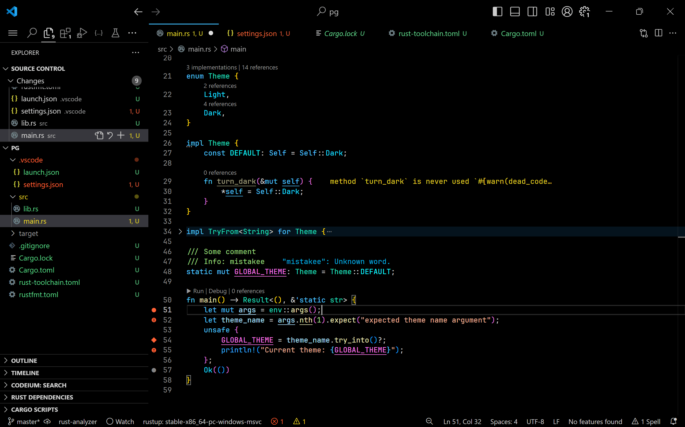
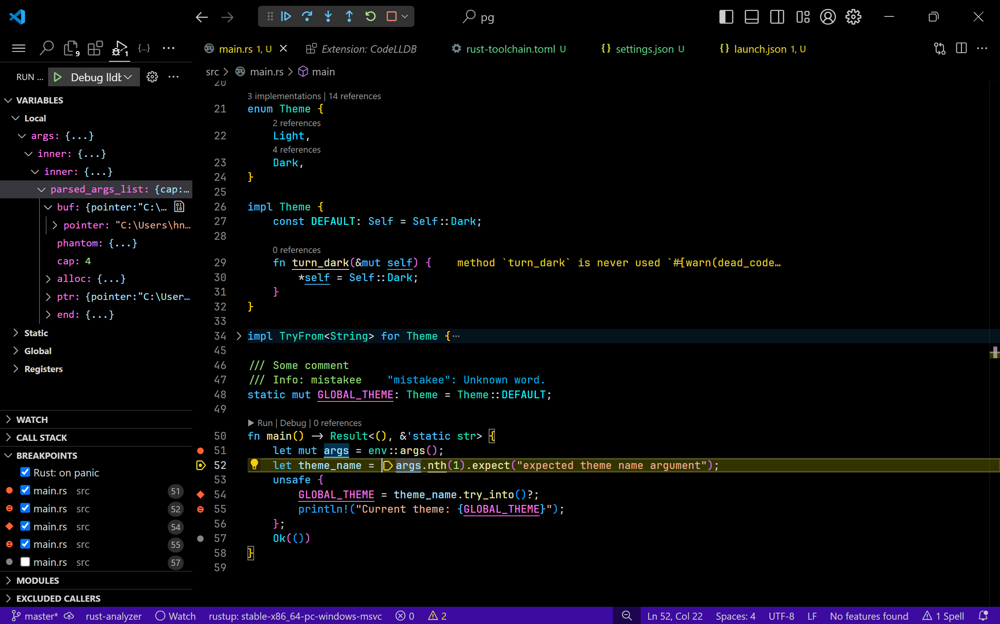

# Vibrant Abyss

[![Visual Studio Marketplace]][Marketplace]
[![Installs]][Marketplace]
[![Rating]][Marketplace]

[Visual Studio Marketplace]: https://img.shields.io/visual-studio-marketplace/v/noelhorvath.vibrant-abyss?style=for-the-badge&label=Visual%20Studio%20Marketplace
[Installs]: https://img.shields.io/visual-studio-marketplace/i/noelhorvath.vibrant-abyss?style=for-the-badge&label=Installs
[Rating]: https://img.shields.io/visual-studio-marketplace/r/noelhorvath.vibrant-abyss?style=for-the-badge

* [Description](#description)
* [Features](#features)
* [Screenshots](#screenshots)
* [Installation](#installation)
* [License](#license)

## Description

Vibrant Abyss is a Visual Studio Code dark theme designed for optimal display
on high contrast screens.

## Features

- Dark theme
- Pitch black
- Vibrant colors
- Tailored for
    - `C#`
    - `Rust`

# Screenshots

 

# Installation methods

* Using [extension file]
* From [Visual Studio Marketplace][Marketplace]
* [Building from source][Manual]

## License

This project is unlicensed. You are free to use, modify, and distribute the
code without any restrictions. Refer to the [LICENSE] file for more details.

[extension file]: https://github.com/noelhorvath/vibrant-abyss/releases/latest
[LICENSE]: LICENSE.md
[Manual]: MANUAL.md
[Marketplace]: https://marketplace.visualstudio.com/items?itemName=noelhorvath.vibrant-abyss
